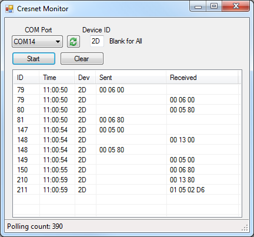

First push of this project to GitHub is a mirror of CodePlex project by [DosMan](https://www.codeplex.com/site/users/view/DosMan) that appeared on CodePlex in April 2015 and is still available on CodePlex. A number of changes are planned in future updates.

# Crestron Cresnet Monitor #

## Project Description ##

Crestron control systems use the Cresnet bus for communication between devices. This project is a simple Windows Forms application that monitors the Cresnet bus and reports the content of messages sent between devices.

Cresnet uses half-duplex RS-485 signals to carry its messages. To monitor this with a PC requires a device such as the [SparkFun USB to RS-485 Converter](https://www.sparkfun.com/products/9822), part no. BOB-09822 from SparkFun Electronics. Once connected and device drivers installed, this device will add a COM port that monitors all communications on the bus.

The Cresnet monitor program can report messages sent to/from a single device, or it can report messages for all devices. Messages are reported as a sequence of hex bytes, broken out as sent or received by the master controller. The Documentation section has a screen shot of the application.

## Using the Cresnet Monitor ##

First select the COM port from the dropdown, and enter the device ID to monitor. Leaving the Device ID blank or entering zero means all devices are monitored. Changing these entries will have no effect when monitoring is in progress.

Click the Start button to start monitoring. The button will toggle to “Stop” when monitoring is in progress. On an active Cresnet bus, the counter of polling cycles will count rapidly.

The ID column has the polling cycle count at the time of the message. The Dev column is the device ID the message was sent to or received from. "Sent" and "Received" are relative the bus controller.

Last edited May 7, 2015 at 12:56 PM by [DosMan](https://www.codeplex.com/site/users/view/DosMan), version 10